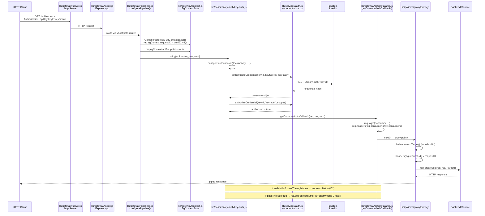
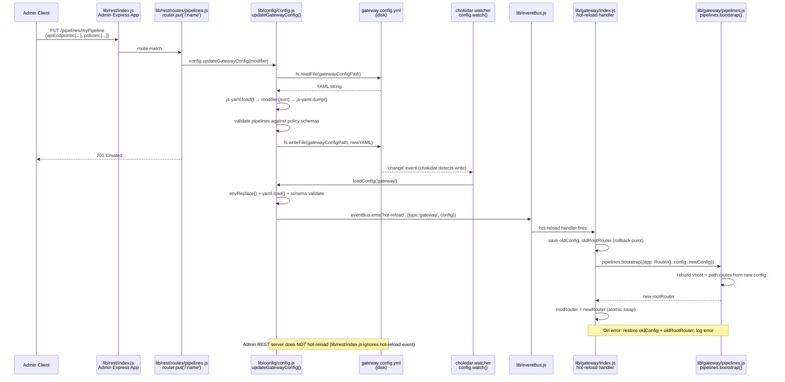
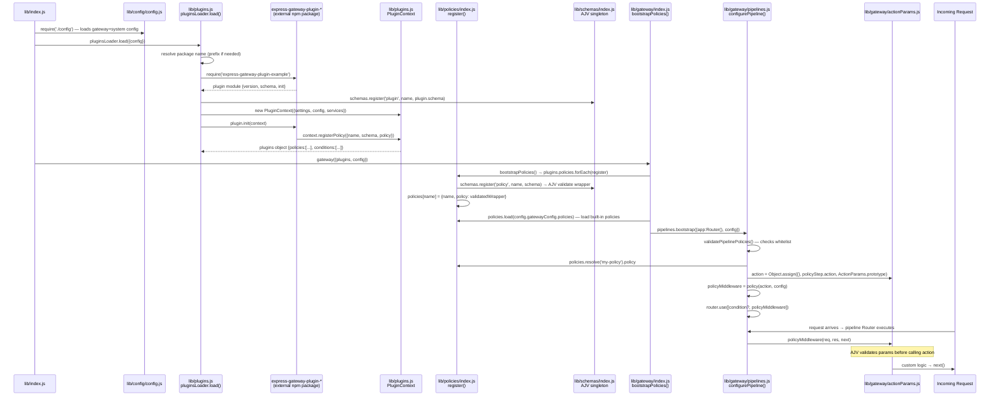

# Current-State Architecture — express-gateway v1.16.10

**Source:** Derived from `docs/discovery/discovery-report.md` (module map), `docs/discovery/journeys.md` (journey traces), and direct source reading of `lib/` during G1.

---

## Component Diagram

```mermaid
graph TD
    subgraph "Process: express-gateway"
        entry["lib/index.js\n(entry point)"]
        config["lib/config/config.js\nConfig + Watcher"]
        plugins["lib/plugins.js\nPlugin Loader / PluginContext"]
        schemas["lib/schemas/index.js\nAJV Singleton"]
        eventBus["lib/eventBus.js\nEventEmitter Singleton"]
        db["lib/db.js\nioredis Singleton"]

        subgraph "Gateway Server (:8080)"
            gwIndex["lib/gateway/index.js\nbootstrap()"]
            gwPipelines["lib/gateway/pipelines.js\nconfigurePipeline()"]
            gwServer["lib/gateway/server.js\nhttp/https Server"]
            gwContext["lib/gateway/context.js\nEgContextBase (per-req)"]
            gwActionParams["lib/gateway/actionParams.js\nActionParams mixin"]
            conditions["lib/conditions/index.js\nCondition Registry"]
        end

        subgraph "Policy Registry"
            policyIndex["lib/policies/index.js\nregister / resolve / load"]
            pBasicAuth["lib/policies/basic-auth/"]
            pKeyAuth["lib/policies/key-auth/"]
            pJWT["lib/policies/jwt/"]
            pOAuth2["lib/policies/oauth2/"]
            pProxy["lib/policies/proxy/proxy.js"]
            pRateLimit["lib/policies/rate-limit/"]
            pOthers["lib/policies/\ncors, expression, headers,\nlog, terminate, transformers"]
        end

        subgraph "Admin Server (:9876)"
            restIndex["lib/rest/index.js\nAdmin Express App"]
            restRoutes["lib/rest/routes/\nusers, apps, credentials,\ntokens, pipelines, endpoints,\nscopes, policies, schemas"]
        end

        subgraph "Services Layer"
            svcIndex["lib/services/index.js"]
            svcUtils["lib/services/utils.js\nencrypt() / decrypt() ⚠️KD-001"]
            svcTokens["lib/services/tokens/\ntoken.service.js"]
            svcCreds["lib/services/credentials/\ncredential.service.js"]
            svcUsers["lib/services/consumers/\nuser.service.js"]
            svcApps["lib/services/consumers/\napplication.service.js"]
            svcAuthCodes["lib/services/authorization-codes/"]
            svcAuth["lib/services/auth.js"]
        end

        passport["passport\n(auth strategies)"]
        logger["lib/logger.js\nWinston"]
    end

    subgraph "External"
        redis[("Redis :6379\n(or ioredis-mock)")]
        backend["Backend Services"]
        pluginPkg["express-gateway-plugin-*\n(npm packages)"]
        cfgFiles[["EG_CONFIG_DIR/\ngateway.config.yml\nsystem.config.yml"]]
    end

    CLIENT["HTTP Client"] -->|:8080| gwServer
    ADMIN["Admin Client"] -->|:9876| restIndex
    OPERATOR["CLI / eg"] -->|HTTP| restIndex

    entry --> config
    entry --> plugins
    entry --> gwIndex
    entry --> restIndex

    config -->|reads/watches| cfgFiles
    config --> schemas
    config --> eventBus

    plugins -->|reads| config
    plugins -->|loads| pluginPkg
    plugins --> schemas
    plugins --> svcIndex

    gwIndex --> gwPipelines
    gwIndex --> gwServer
    gwIndex --> policyIndex
    gwIndex --> conditions
    gwIndex -->|listens hot-reload| eventBus

    gwPipelines --> policyIndex
    gwPipelines --> conditions
    gwPipelines --> gwContext
    gwPipelines --> gwActionParams

    policyIndex --> schemas
    policyIndex --> pBasicAuth
    policyIndex --> pKeyAuth
    policyIndex --> pJWT
    policyIndex --> pOAuth2
    policyIndex --> pProxy
    policyIndex --> pRateLimit
    policyIndex --> pOthers

    pBasicAuth --> passport
    pKeyAuth --> passport
    pJWT --> passport
    pOAuth2 --> passport

    pBasicAuth --> svcAuth
    pKeyAuth --> svcAuth
    pOAuth2 --> svcTokens
    pOAuth2 --> svcCreds

    pProxy -->|http-proxy| backend

    svcAuth --> svcCreds
    svcTokens --> svcUtils
    svcCreds --> svcUtils
    svcUtils -->|crypto.createCipher ⚠️| schemas

    svcIndex --> svcTokens
    svcIndex --> svcCreds
    svcIndex --> svcUsers
    svcIndex --> svcApps
    svcIndex --> svcAuthCodes
    svcIndex --> svcAuth

    svcTokens --> db
    svcCreds --> db
    svcUsers --> db
    svcApps --> db
    svcAuthCodes --> db
    db --> redis

    restIndex --> restRoutes
    restRoutes --> config
    restRoutes --> svcIndex
    restRoutes -->|updateGatewayConfig| cfgFiles

    gwIndex --> logger
    restIndex --> logger
    policyIndex --> logger
    svcIndex --> logger
```

---

## Sequence Diagram — Journey A: Auth → Proxy Pipeline

*Source: `docs/discovery/journeys.md` § Journey A*

---

## Sequence Diagram — Journey B: Admin API + Hot-Reload

*Source: `docs/discovery/journeys.md` § Journey B*

---

## Sequence Diagram — Journey C: Plugin Loading and Policy Chain

*Source: `docs/discovery/journeys.md` § Journey C*

---

## Boundary Crossings by Journey

| Journey | Boundaries Crossed | Critical Modules |
|---|---|---|
| A (auth→proxy) | Client→Server→Policy→Services→Redis→Backend | `gateway/server.js`, `gateway/pipelines.js`, `policies/key-auth`, `services/auth.js`, `services/credentials/credential.dao.js`, `db.js` |
| B (admin+hotreload) | AdminClient→AdminServer→Config→Disk→Chokidar→EventBus→Gateway | `rest/routes/pipelines.js`, `config/config.js`, `eventBus.js`, `gateway/index.js`, `gateway/pipelines.js` |
| C (plugin chain) | Startup→Plugins→PolicyRegistry→Schemas→Gateway→Request | `plugins.js`, `policies/index.js`, `schemas/index.js`, `gateway/index.js`, `gateway/pipelines.js`, `gateway/actionParams.js` |
